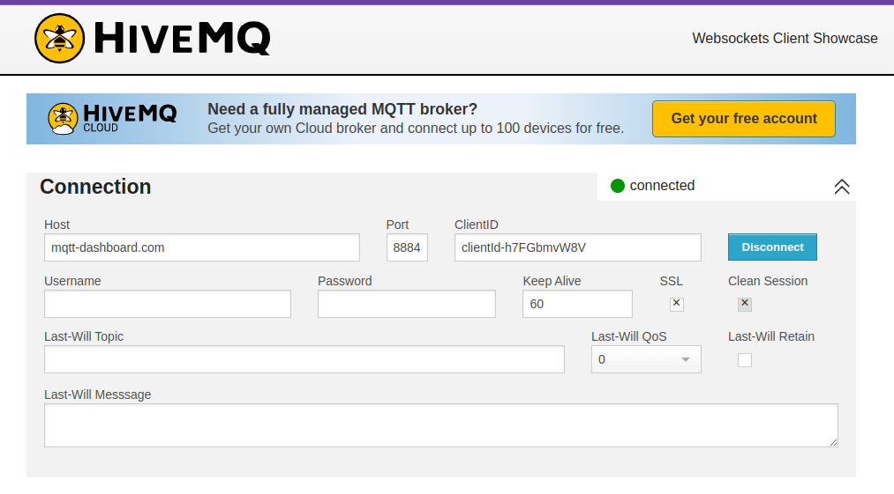
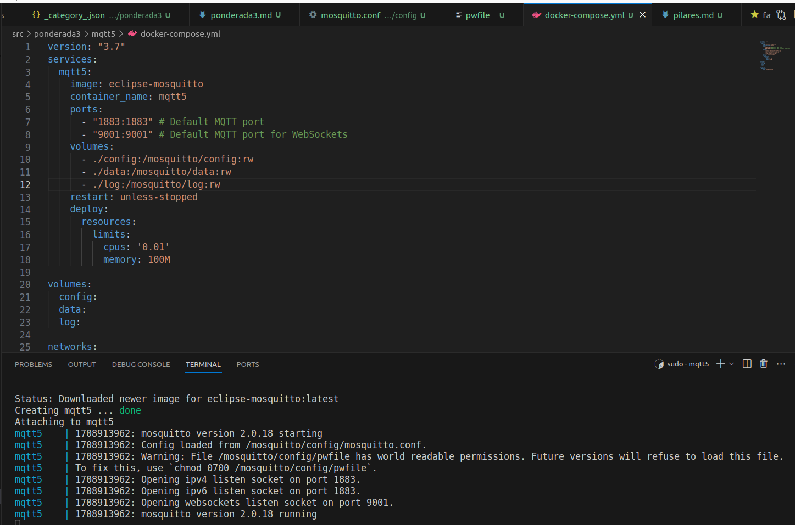
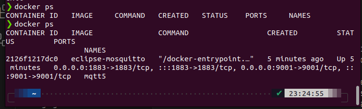
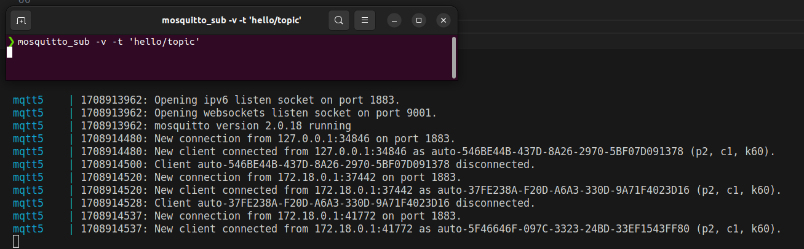
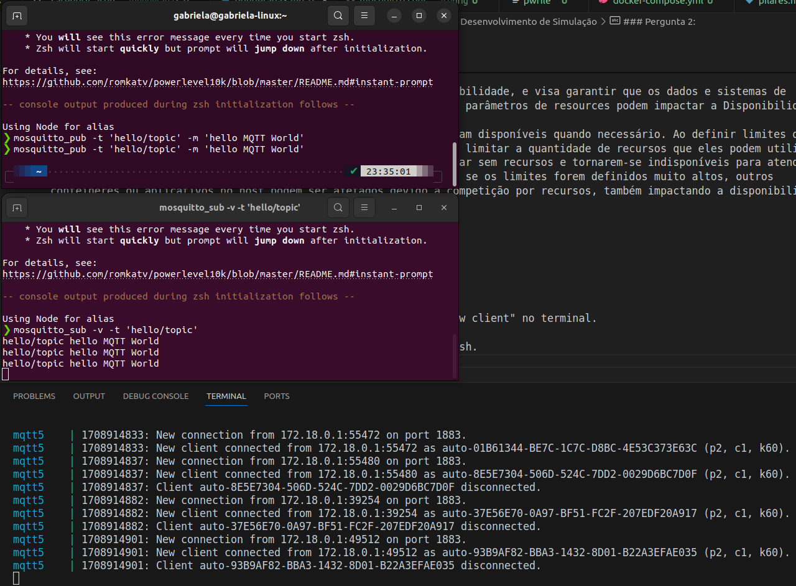
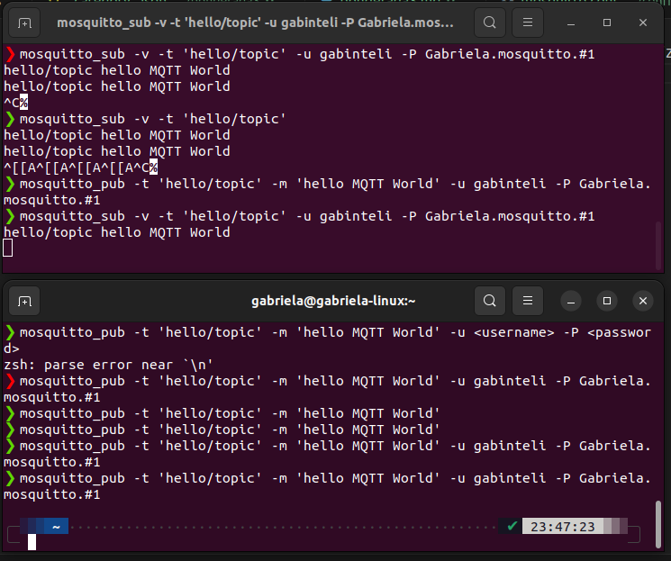

# Simulação de ataques usando MQTT

## Simulação de Envio e Captação de Dados de Sensores
Subir um broker remoto e um broker local do MQTT para conduzir cenários de análise de vulnerabilidade (dentro do CIA Triad), identificando situações onde pode ser comprometido cada um dos três pilares: Confiabilidade, Integridade e Disponibilidade.

## Objetivo 
Introdução ao conceito de segurança da informação para ambientes IoT. Apresentação dos fundamentos de segurança como proteção de dados em trânsito e em armazenamento, autenticação e autorização da comunicação. Discussão sobre pertinência de cada uma das estratégias de proteção.

## Desenvolvimento de Simulação

1. Seleção algum aplicativo de cliente MQTT.

2. Seleção de um broker público.

3. Faça a conexão com o broker e anote o ClientID utilizado.

### Pergunta 1: 
O que acontece se você utilizar o mesmo ClientID em outra máquina ou sessão do browser? Algum pilar do CIA Triad é violado com isso?

Se você usar o mesmo ClientID em outra máquina ou sessão do navegador, geralmente o broker MQTT substituirá a conexão anterior com o mesmo ClientID pela nova conexão. Isso ocorre porque o ClientID é uma identificação única para cada cliente MQTT e é usado pelo broker para identificar e rastrear os clientes conectados.

- Violação do Pilar da Integridade:
O uso do mesmo ClientID em várias máquinas ou sessões pode resultar em conflitos e substituições de conexão no broker MQTT. Isso pode comprometer a integridade dos dados transmitidos, pois não há garantia de que todas as mensagens destinadas ao ClientID estejam sendo entregues ao cliente correto.

- Violação do Pilar da Disponibilidade:
Além disso, o uso de ClientID duplicados pode afetar a disponibilidade do serviço MQTT, pois o broker pode ficar sobrecarregado com várias conexões tentando usar o mesmo identificador. Isso pode levar a interrupções no serviço para outros clientes legítimos que estão tentando se conectar ao broker.

4. Criação de um ambiente containerizado para rodar localmente uma versão do Mosquitto, é uma boa prática criar um contexto separado para analisar por vulnerabilidades em um sistema, também chamado de Sandbox.

5. Escolha uma pasta no seu OS e crie a pasta do container Mosquitto e dentro a sua pasta de config. 

6. Crie o arquivo config/mosquitto.conf com as infos necessárias.

7. Crie o arquivo config/pwfile e deixe ele em branco.

8. Crie o arquivo docker-compose.yml na pasta raíz do contêiner.

9. Subindo o container: 

### Pergunta 2: 
Com os parâmetros de resources, algum pilar do CIA Triad pode ser facilmente violado?

Sim, os parâmetros de resources em um arquivo de configuração do Docker Compose podem afetar o pilar de Disponibilidade da tríade CIA.

A tríade CIA consiste em Confidencialidade, Integridade e Disponibilidade, e visa garantir que os dados e sistemas de informação sejam protegidos adequadamente. Vamos analisar como os parâmetros de resources podem impactar a Disponibilidade:

Disponibilidade: Este pilar garante que os sistemas e dados estejam disponíveis quando necessário. Ao definir limites de recursos como CPU e memória para os contêineres Docker, você pode limitar a quantidade de recursos que eles podem utilizar. Se os limites forem definidos muito baixos, os contêineres podem ficar sem recursos e tornarem-se indisponíveis para atender às solicitações, resultando em tempo de inatividade. Por outro lado, se os limites forem definidos muito altos, outros contêineres ou aplicativos no host podem ser afetados devido à competição por recursos, também impactando a disponibilidade.

10. Vamos verificar se o contêiner está rodando normalmente. 

11. Com o contêiner funcionando, vamos acessar a shell dele.

12. Vamos fazer o Subscribe em um tópico (sem autenticação).

Ao acessar o tópico, o meu container sinaliza a entrada de um "new client" no terminal. 

13. Abra outro terminal, entre no contêiner e vamos fazer o Publish.

### Pergunta 3: 
Sem autenticação (repare que a variável allow_anonymous está como true), como a parte de confidencialidade pode ser violada?

A falta de autenticação no MQTT pode comprometer a confidencialidade dos dados, permitindo acesso não autorizado e divulgação não intencional de informações sensíveis. É importante habilitar a autenticação e implementar medidas de segurança adequadas, como autenticação por usuário e senha, para proteger os dados transmitidos através do MQTT.

14. Vamos implementar a camada de autenticação, começando por reabrir o arquivo config/mosquitto.conf e modificar a primeira linha, trocando a variável allow_anonymous para false.

15. Dentro do contêiner (acesse a shell dele), vamos criar o usuário. 

16. Reinicie o contêiner para refletir as novas configurações

17. A partir de agora, as ações de Subscribe / Publish terão que passar por uma camada de autenticação para serem efetivadas

