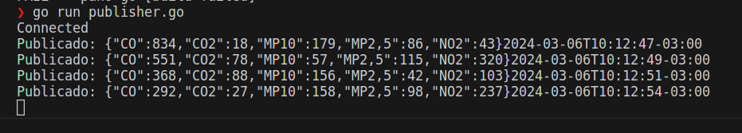

# Simulador IoT - Broker em Cloud

## Simulação de Envio e Captação de Dados de Sensores
Criar um simulador de dispositivos IoT utilizando o protocolo MQTT através do uso da biblioteca Eclipse Paho. 
Este projeto inclui uma estrutura de publisher e subscriber desenvolvida com Go, que publica mensagens JSON em um tópico MQTT e um que recebe, utilizando um broker hospedado em Cloud no HiveMQ. As mensagens contêm dados simulados de medições, respeitando especificações técnicas como faixa de medição e alcance espectral, alem disso para garantir uma variação de dados, os valores são aleatórios dentro de um intervalo estabelecido pelo código.


### Repositório de Resolução do Projeto

[✔] [Ponderada 4](https://github.com/gabInteli/M9-Inteli-Eng-Comp_Gabriela_Matias/tree/main/src/ponderada4)

## Requisitos
- Mosquitto
- Paho MQTT
- Python
- Go
- Cluster - HiveMQ  

##  Modo de Execução 

### Instalando Dependências - Go Mod
Acesse o diretório que contém as dependências necessárias para cada função: 

Para o publisher:
```
cd /src/ponderada4/src/pub
go mod tidy
```

Para o subscriber:
```
cd /src/ponderada4/src/sub
go mod tidy
```

### Executando o Publisher

Para executar o script do publisher, navegue até o diretório onde o arquivo publisher.go e execute o arquivo.
```
cd /src/ponderada2/src/pub
go run publisher.go

```

Isso iniciará o script que publicará mensagens JSON simuladas para o tópico MQTT no intervalo definido. 
O script imprimirá no terminal cada mensagem que for publicada.



### Executando o Subscriber

Para executar o script do subscriber, navegue até o diretório onde o arquivo subscriber.go e execute o arquivo: 
```
cd /src/ponderada2/src/pub
go run subscriber.go

```

Isso iniciará o script que receberá as mensagens JSON simuladas para o tópico MQTT no intervalo definido. O script imprimirá no terminal cada mensagem que for recebida.


### Rodando os Testes

Acesse o diretório: 
```
/src/ponderada2/src/pub
```

Rode o comando: 
```
go test -v
```

Resultado esperado: 

```
❯ go test -v
=== RUN   TestConnectToMQTTBroker
Connected
    pub_test.go:29: Conexão com o broker MQTT estabelecida com sucesso.
--- PASS: TestConnectToMQTTBroker (2.19s)
=== RUN   TestGenerateData
    pub_test.go:45: Dados gerados validados com sucesso.
--- PASS: TestGenerateData (0.00s)
=== RUN   TestPublishAndReceiveMessages
Connected
Connection lost: EOF    pub_test.go:109: Mensagem recebida com sucesso.
--- PASS: TestPublishAndReceiveMessages (2.92s)
PASS
ok      paho-go 5.117s
```

______________________________________________________________________________________________

## Teste de Conexão com o Broker MQTT

### Propósito:
Este teste verifica se é possível estabelecer uma conexão com o broker MQTT especificado.

### Entrada:
- Nenhuma entrada explícita.

### Saída Esperada:
- Conexão bem-sucedida com o broker MQTT.

## Teste de Geração de Dados

### Propósito:
Este teste verifica se os dados gerados pela função `GenerateData` estão completos e contêm todos os campos esperados.

### Entrada:
- Nenhuma entrada explícita.

### Saída Esperada:
- Mapa contendo os seguintes campos:
  - CO2: Concentração de CO2.
  - CO: Concentração de CO.
  - NO2: Concentração de NO2.
  - MP10: Concentração de partículas MP10.
  - MP2,5: Concentração de partículas MP2,5.

## Teste de Publicação e Recebimento de Mensagens MQTT

### Propósito:
Este teste simula o processo de publicação e recebimento de mensagens MQTT.

### Entrada:
- Mensagem JSON contendo dados de sensores gerados aleatoriamente.

### Saída Esperada:
- Mensagem JSON recebida com sucesso, contendo os mesmos campos e valores da mensagem publicada.

### Passos do Teste:
1. Publicar uma mensagem MQTT contendo dados de sensores gerados aleatoriamente.
2. Aguardar a recebimento da mensagem publicada no tópico MQTT especificado.
3. Verificar se a mensagem recebida contém todos os campos esperados e se os valores estão dentro dos limites esperados.
4. Reportar um erro se a mensagem não for recebida dentro do tempo limite especificado.

Para cada teste, são fornecidas explicações detalhadas sobre o que o teste faz e qual é o seu propósito.

### Demonstração: 

A demonstração pode ser verificada no vídeo abaixo:  
<iframe width="560" height="315" src="https://www.youtube.com/embed/BLZi2s0_BUQ?si=HXYYzJdJZpabjSZm" title="YouTube video player" frameborder="0" allow="accelerometer; autoplay; clipboard-write; encrypted-media; gyroscope; picture-in-picture; web-share" allowfullscreen></iframe>