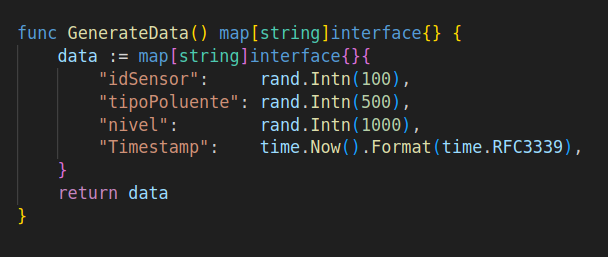
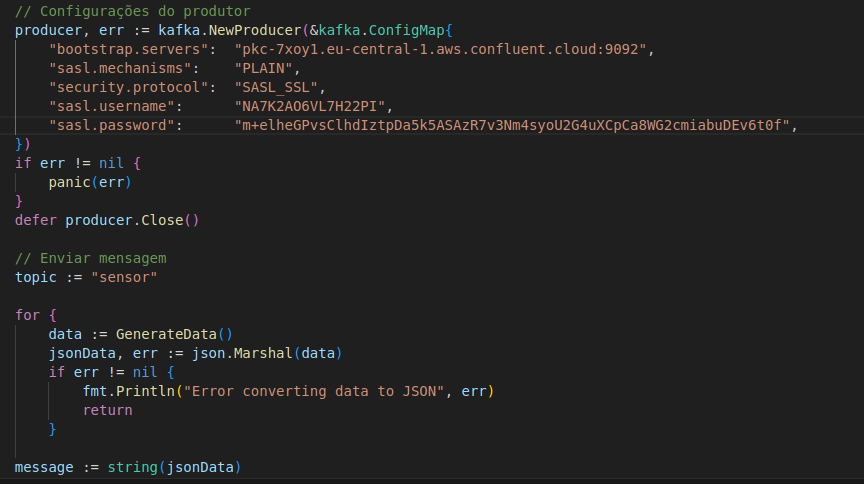
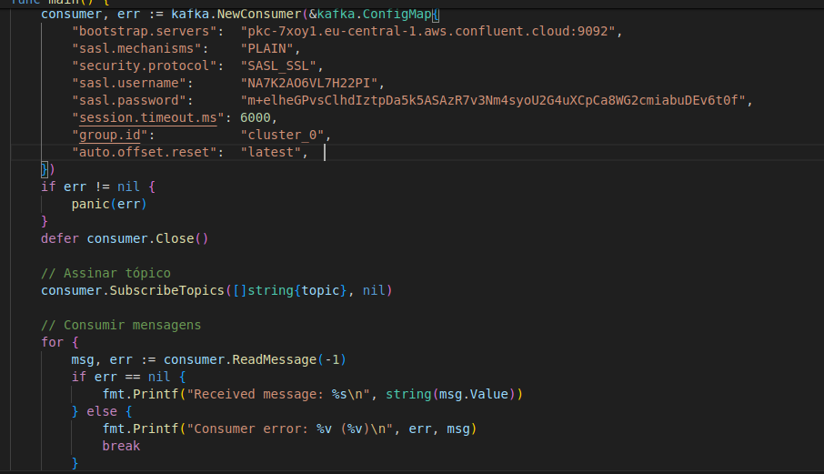
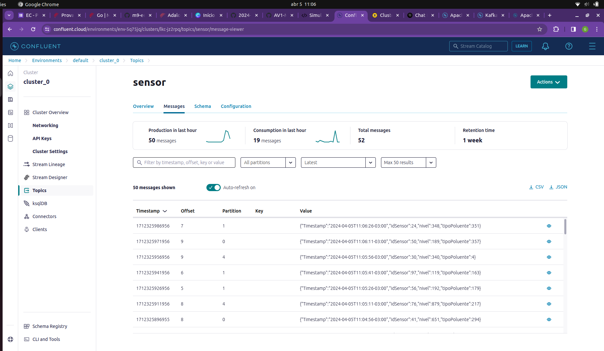
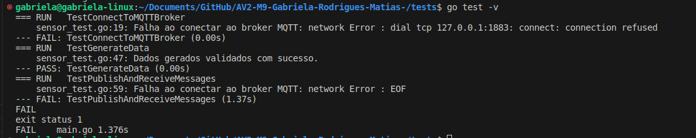

# Criação e Integração de Cluster com Cloud - Kafka + HiveMQ 

## Objetivo
Nessa atividade, deve-se desenvonver a integração entre o cluster do HiveMQ e um provedor de Kafka em nuvem.

### Repositório de Resolução do Projeto

[✔] [Ponderada X](https://github.com/gabInteli/M9-Inteli-Eng-Comp_Gabriela_Matias/tree/main/src/ponderadaX)

## Requisitos
- Python
- Go
- Criação de um Cluster com Confluent Kafka
- Criação de um Broker com HiveMQ

## Validação de Critérios 

### Criação de um Producer 
1. Estrutura de Dados:


2. Criação de um Producer


### Criação de um Consumer 


### Armazenamento dos Dados


### Implementação de Testes

##  Modo de Execução 

### Criando Clusters e Broker de Dependências - Go Mod

### Instalando Dependências
Acesse o diretorio que contem as dependências necessárias.
Acione as dependências para cada uma das pastas, com: 
```
go mod tidy
```

### Executando o Producer/Consumer

A demonstração pode ser verificada no vídeo abaixo:  
<iframe width="560" height="315" src="https://www.youtube.com/embed/eT6XUvVzdfA?si=nNfXNR7ATuIGX7Ij" title="YouTube video player" frameborder="0" allow="accelerometer; autoplay; clipboard-write; encrypted-media; gyroscope; picture-in-picture; web-share" referrerpolicy="strict-origin-when-cross-origin" allowfullscreen></iframe>

Obs.: Tive problemas com o teste final. Como apresentada a falha no vídeo. 

### Rodando os Testes

Acesse o diretorio: 

```
/tests
```

Rode o comando: 
```
go test -v
```

Resultado esperado: 
```
=== RUN   TestConnectToMQTTBroker
    sensor_test.go:19: Falha ao conectar ao broker MQTT: network Error : dial tcp 127.0.0.1:1883: connect: connection refused
--- FAIL: TestConnectToMQTTBroker (0.00s)
=== RUN   TestGenerateData
    sensor_test.go:47: Dados gerados validados com sucesso.
--- PASS: TestGenerateData (0.00s)
=== RUN   TestPublishAndReceiveMessages
    sensor_test.go:59: Falha ao conectar ao broker MQTT: network Error : EOF
--- FAIL: TestPublishAndReceiveMessages (1.37s)
FAIL
exit status 1
FAIL    main.go 1.376s
```



### Demonstração: 

A demonstração pode ser verificada no vídeo abaixo:  
<iframe width="560" height="315" src="https://www.youtube.com/embed/zFYoQ6FOw6U?si=8m9LGWfUcieOxIt0" title="YouTube video player" frameborder="0" allow="accelerometer; autoplay; clipboard-write; encrypted-media; gyroscope; picture-in-picture; web-share" allowfullscreen></iframe>