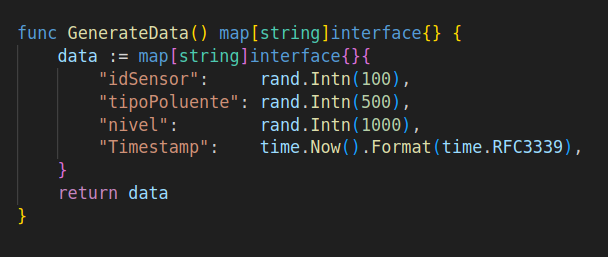
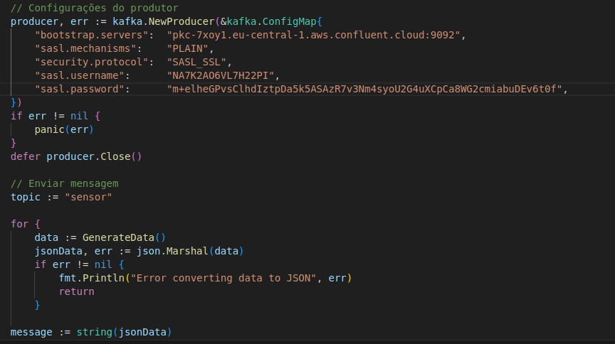
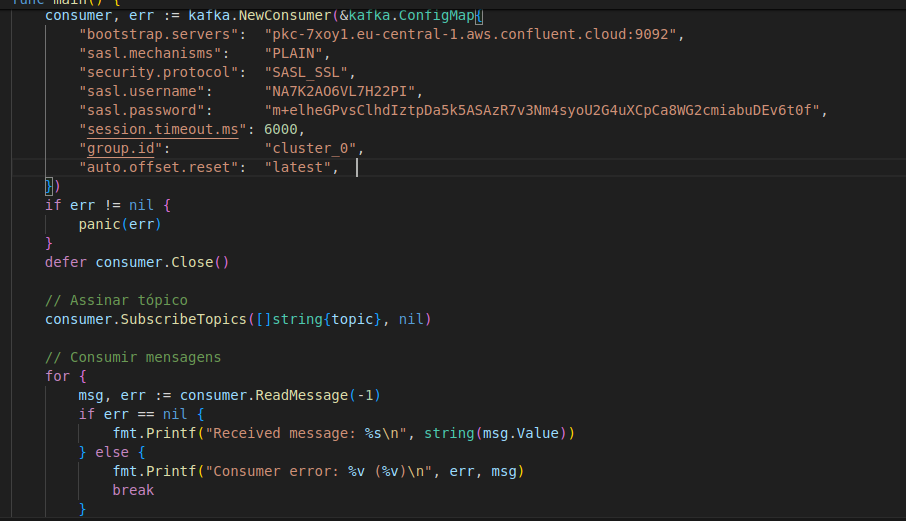
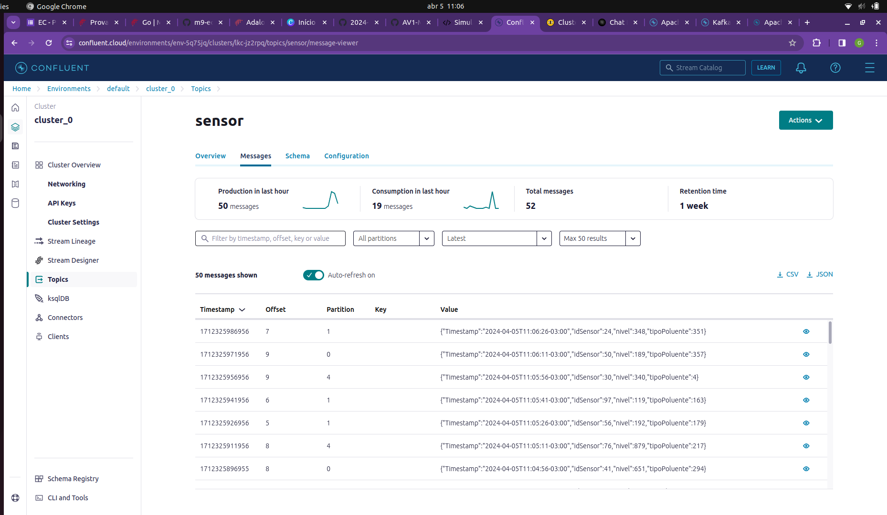
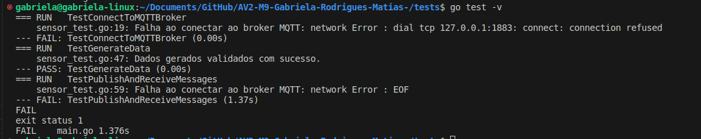

## Gabriela Rodrigues Matias - Avaliação 2
### Engenharia da Computação

# Simulador IoT com Armazenamento de Dados e Gestão de Fila

## Critérios de Conclusão

1. Implementar um Producer (Produtor): Deve coletar dados simulados de sensores de qualidade do ar e publicá-los em um tópico do Kafka chamado sensor (**aqui eu não tinha notado o nome do topico e coloquei outro, perdão**). Os dados devem incluir:
2. Id do sensor, timestamp, tipo de poluente e nivel da medida.
3. Implementar um Consumer (Consumidor): Deve assinar o tópico qualidadeAr e processar os dados recebidos, exibindo-os em um formato legível, além de armazená-los para análise posterior (escolha a forma de armazenamento que achar mais adequada).
4. Implementar testes de Integridade e Persistência: Criar testes automatizados que validem a integridade dos dados transmitidos (verificando se os dados recebidos são iguais aos enviados) e a persistência dos dados (assegurando que os dados continuem acessíveis para consulta futura, mesmo após terem sido consumidos).

## Requisitos
- Python
- Go
- Criação de um Cluster com Confluent Kafka
- Criação de um Broker com HiveMQ

## Validação de Critérios 

### Criação de um Producer 
1. Estrutura de Dados:


2. Criação de um Producer


### Criação de um Consumer 


### Armazenamento dos Dados


### Implementação de Testes

##  Modo de Execução 

### Criando Clusters e Broker de Dependências - Go Mod


### Instalando Dependências
Acesse o diretorio que contem as dependências necessárias.
Acione as dependências para cada uma das pastas, com: 
```
go mod tidy
```

### Executando o Producer/Consumer

A demonstração pode ser verificada no vídeo abaixo:  
[Vídeo de Demonstração](https://www.youtube.com/watch?v=eT6XUvVzdfA)

Obs.: Tive problemas com o teste final. Como apresentada a falha no vídeo. 

### Rodando os Testes

Acesse o diretorio: 

```
/tests
```

Rode o comando: 
```
go test -v
```

Resultado esperado: 
```
=== RUN   TestConnectToMQTTBroker
    sensor_test.go:19: Falha ao conectar ao broker MQTT: network Error : dial tcp 127.0.0.1:1883: connect: connection refused
--- FAIL: TestConnectToMQTTBroker (0.00s)
=== RUN   TestGenerateData
    sensor_test.go:47: Dados gerados validados com sucesso.
--- PASS: TestGenerateData (0.00s)
=== RUN   TestPublishAndReceiveMessages
    sensor_test.go:59: Falha ao conectar ao broker MQTT: network Error : EOF
--- FAIL: TestPublishAndReceiveMessages (1.37s)
FAIL
exit status 1
FAIL    main.go 1.376s
```

